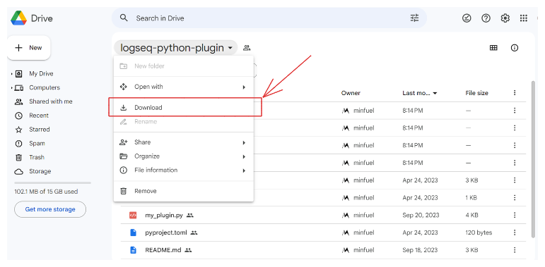
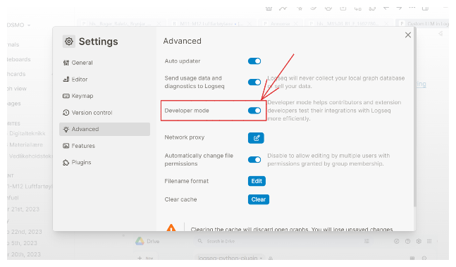
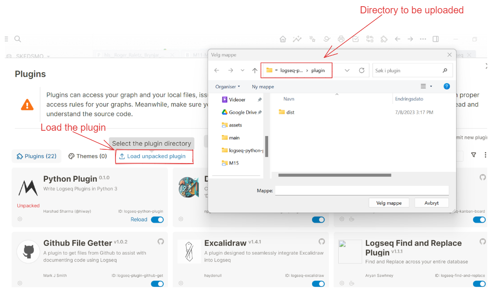

## Downloading

Download the Logseq Python Plugin `this bridges all python capabilities to logseq`: https://drive.google.com/drive/folders/1RyPLA9bCZTn5odv3Cegq-uj6YrpCffBw?usp=sharing
logseq.order-list-type:: number


Unpack the zip file and let's prepare to Load the plugin
logseq.order-list-type:: number \*_Remember to activate developer mode to upload a plugin_


Load up the unzipped folder at this directory `/plugin`
logseq.order-list-type:: number


Setup

- go to the root of the unzipped folder in VSCODE and run this commands
  logseq.order-list-type:: number

```terminal
python -m venv venv
.\venv\Scripts\activate
pip install -e .
python my_plugin.py

```

Usage

- Clicking the run.bat run the command line
