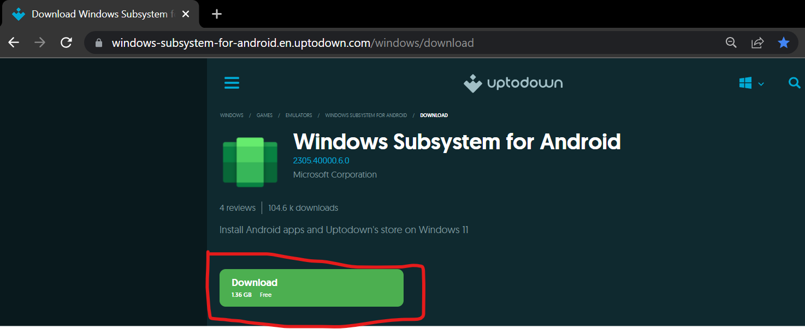
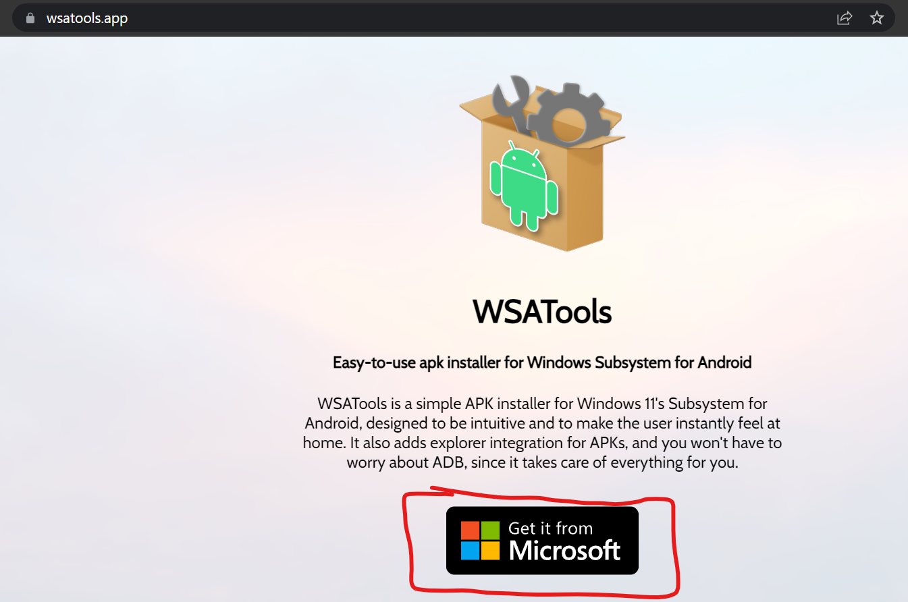
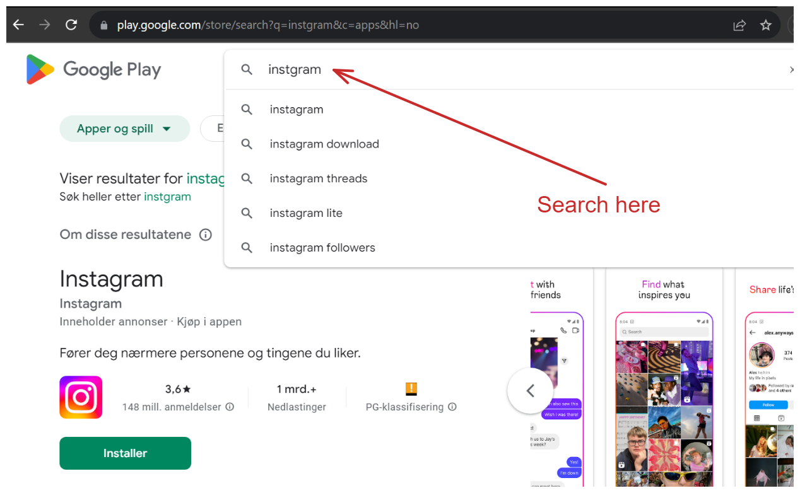
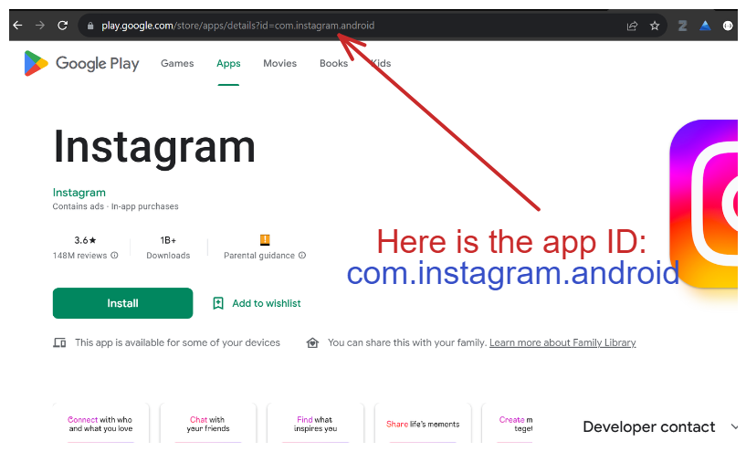
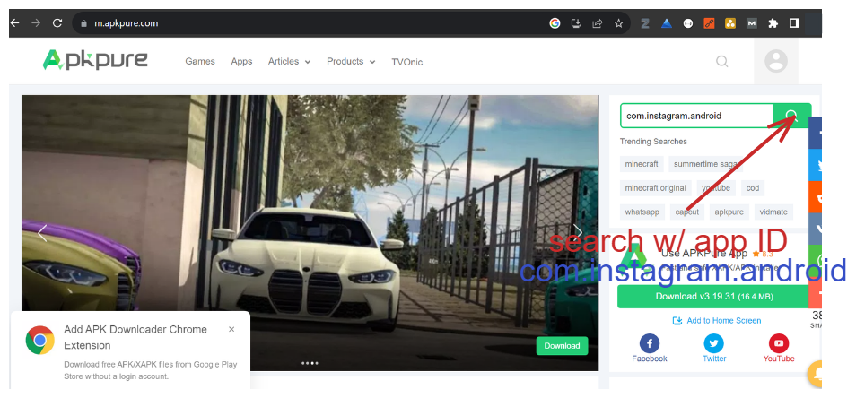
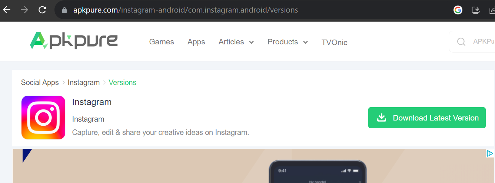
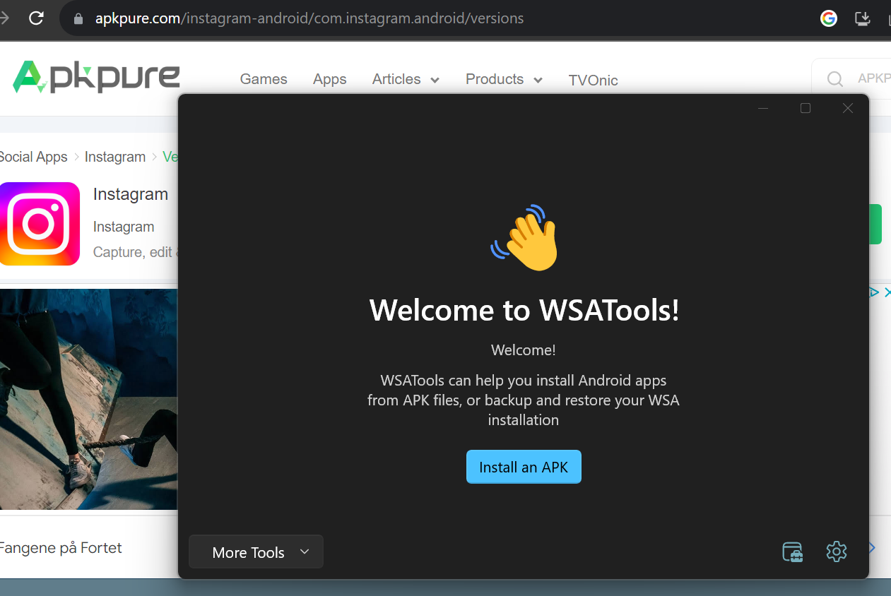
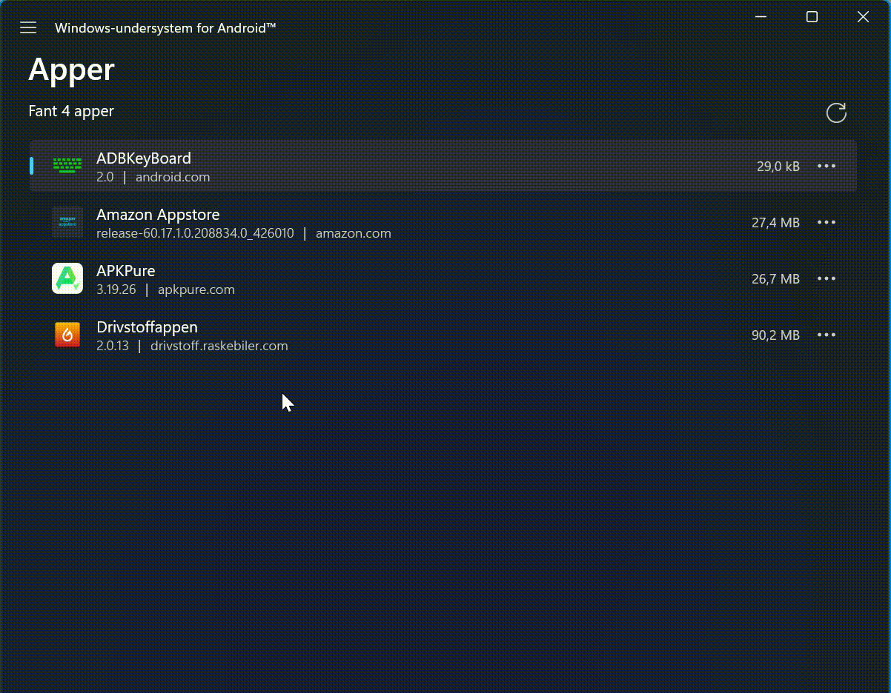

## Installations

- **Check if your PC is compatible.** Not all Windows 11 PCs can run Android apps. To check if your PC is compatible, open the Settings app and go to **System > About**. Under “Specifications,” look for “Processor,” “RAM,” and “Virtualization.” Your PC must have a 64-bit processor, 4GB of RAM, and virtualization enabled in order to run Android apps.

- **Enable virtualization.** If virtualization is not enabled on your PC, you will need to enable it before you can run Android apps. To enable virtualization, open the Start menu and search for “Turn Windows features on or off.” In the Turn Windows features on or off window, scroll down and look for “Virtualization.” Check the box next to “Virtualization” and click OK. Your PC will restart.

1. [Download WSA (Windows Subsystem for Android™️)](https://windows-subsystem-for-android.en.uptodown.com/windows)
   

2. [Download WSATools APK Installer](https://wsatools.app)
   

## Searching & Downloading any android app in Windows (After Installing🎉🎉)

- 1. Obtain the app ID:

a. Search your desired android app on [playstore web version](https://play.google.com) to get the id, We will use `instagram` as an example:

b. The app ID is located in the url as a parameter! In this case: `com.instagram.android`

-

2. Download the apk file (on you computer):

a. Navigate to [Apkpure.com/](https://m.apkpure.com/) and use the app id to search:

b. Download the apk file version you want:

-

3. Install apk in Windows using [WSATools](https://wsatools.app/):

a. Load the apk file to WSATools from you Downloads folder:

# SUCCESS!!! ⛳⛳

- ## (EXTRA) Enabling ADB

1. 

## ⚒️   Common problems and fixes? Enabling and Troubleshooting ADB

- https://github.com/Simizfo/WSATools/blob/main/Guides/EnableADBDebugging.md
